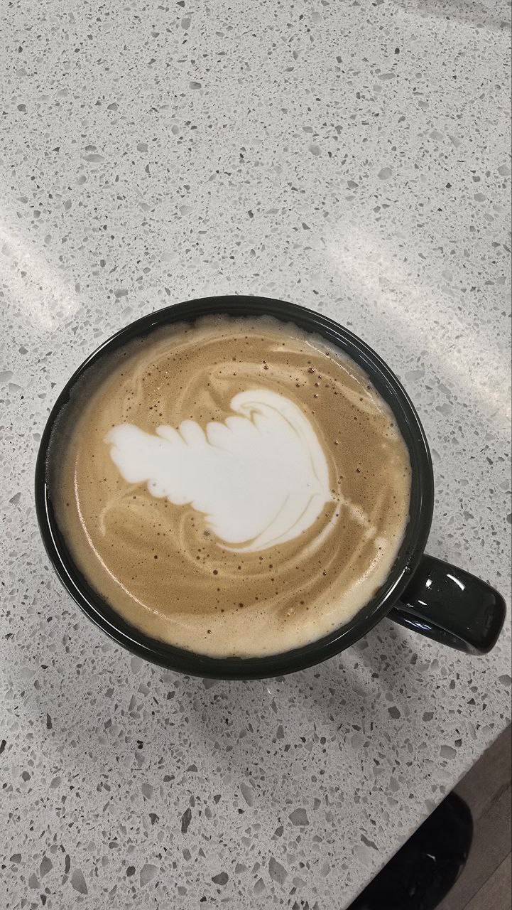

# Beyond Work

I have been a coffee lover since I was a teenager, but I usually drink black coffee. Recently, I became curious about learning how to make latte art. At first, when I watched a couple of videos on YouTube, it looked so straightforward—but when I actually went to the machine to try making beautiful latte art, I failed over and over again!

I could only drink one latte per day, and I didn't want to waste milk and coffee, so I gave myself one chance per day. Some people mimic milk frothing and latte art using dish soap, but for some reason, I preferred the steady, once-per-day attempts. It felt more natural and gradual to me, though progress was slow.

I started with heart-shaped latte art, but my first challenge was frothing the milk correctly. This step is very important and depends on several factors: how powerful your machine's steam wand is, what kind of milk you are using, the milk temperature, where the wand sits in the milk jug, the angle, how long you keep the tip barely touching the surface, and when to lift the jug so it stops adding bubbles. A perfectly forthed milk looks like wet paint; silky and smooth with no bubbles. 

Only after mastering milk frothing can you begin creating visual art. It takes a lot of practice. Below are some of my first attempts at a heart-shaped latte art — when they didn’t quite turn out, I used a spoon to transform them into other shapes:

*Supposed to be a heart, but turned out to be a mushroom with spoon magic when it seemed too far from being a heart!*

*A funny one -- needed some more "air"!*

*The milk texture is not even close! But I transformed it into a surprised goat.*

*The circular pattern is starting to appear on the snail's body, almost there...*

After lots of practice and making free lattes for friends, I finally learned how to froth the milk correctly. I get it right almost every time now—but then comes the art.

The heart was the easiest pattern to start with, so I tried that first. Here are some of my attempts:

*Success! My first heart-shaped latte art. It’s a bit too close to the cup’s wall — I’ll try to fix it tomorrow!*

*Beautiful! I love it! Just need those lines around the heart next.*

Once I could draw a decent heart, I moved on to the Rosetta pattern, which I am still practicing. Here are some shots:

*First Rosetta attempt, not too bad!*

*Second try — I’m getting the hang of it! Poured this one for a friend.*

I will update this page with more beautiful latte art trials.

Note to self: Chase what excites you, even if you fail — it’s worth every attempt!
